# Floro NextJS Demo App

This repository should serve as both a demo and a guide for integrating Floro into your own application. This demo is built with next 14, but you should be able to use this as a guide to integrating into nearly any node-based server application. It is easiest to get the demo to work first and then copy parts of the demo code into your own application.

## Getting the Demo to work

You will need the floro cli to build the floro modules

```bash
npm install -g floro
```

#### System Prerequisites
Built with node v19.9.0 (not sure if that matters)

#### Setup

```bash
yarn
```

```bash
floro module build -m src/app/floro_infra/floro.module.js
```

```bash
yarn dev
```

### Install Floro
If you want to actually experience the demo in full, please download the Floro Desktop app from [Floro](https://floro.io) if you haven't already

### Add the Chrome Extension
[Add Floro Extension](https://chromewebstore.google.com/detail/floro/eimdhkkmhlaieggbggapcoohmefbnlkh)

#### Clone the Floro Repository in Floro
Next clone the repository for this project
[Clone Floro Repo Here](https://github.com/florophore/floro-next-demo).

(This will only work when the Floro desktop client is running)

### Create a Local API Key in Floro
Click developer settings once you are logged into Floro

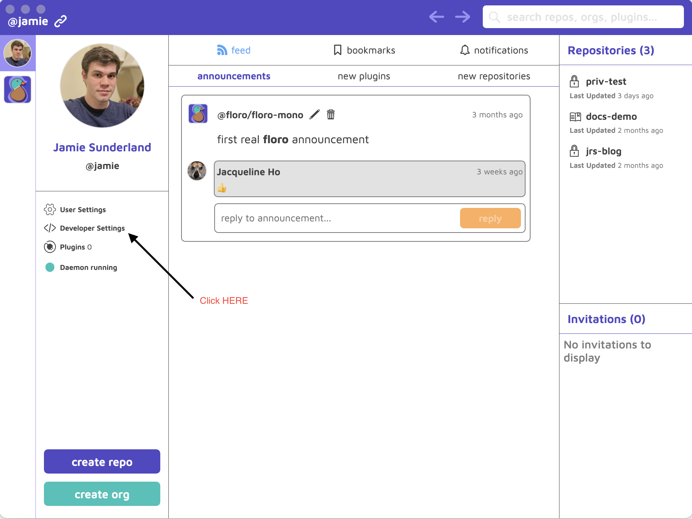

Click on "create api key" (the green button in the lower left). Name your key whatever you want!

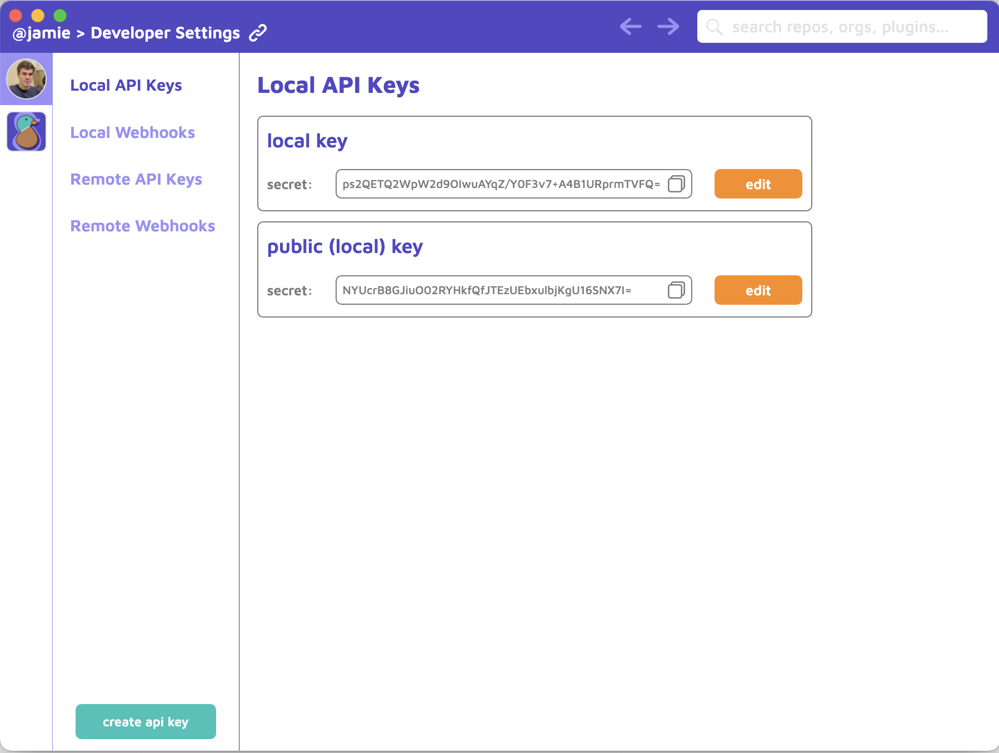

### Attach the API Key to the next-demo repository


[Open the @floro/next-demo Repo Here](https://floro.io/app-proxy/repo/@/floro/next-demo?from=local).

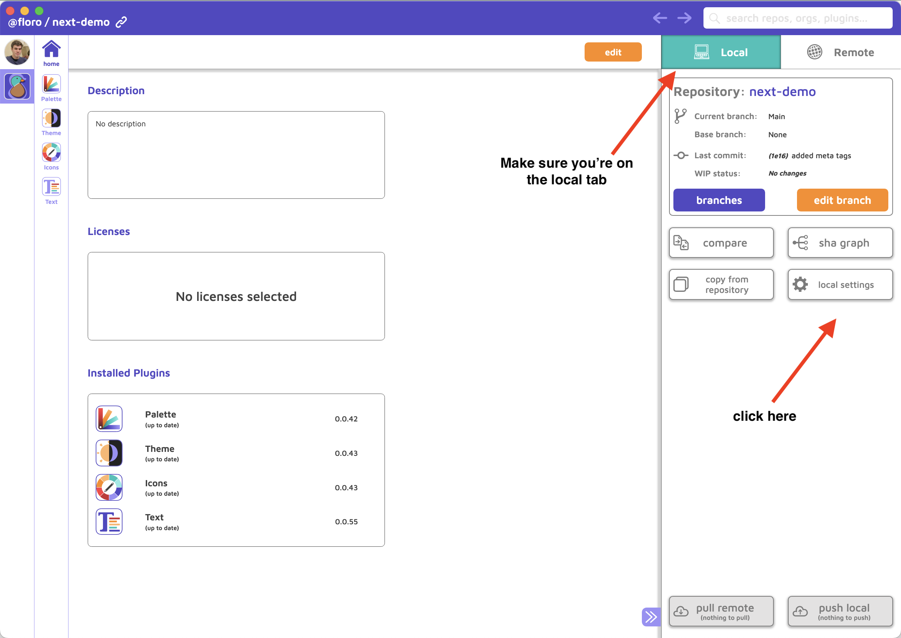

Click on the "local settings" tab


Enable the Local API Key you created in the previous step

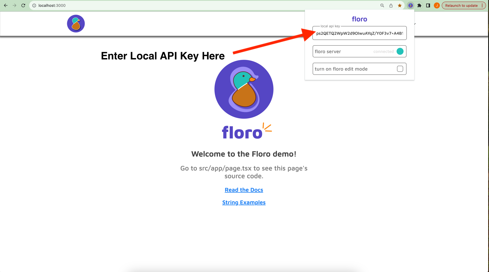

From the chrome extension popup, enter the secret of the (local) api key you connected to the repo in the previous step.


### Third Party API Keys

The plugins shown in this application that interact with APIs are all BYOK.

All API Keys are stored client side (on your machine) and never on the Floro servers. We do have to send your third party API keys in requests to our servers to overcome CORS limitations from DeepL and OpenAI. The controller code for the ML APIs can be found here <a href="https://github.com/florophore/floro-mono/blob/main/packages/backend/src/controllers/proxy/ChatGPTController.ts">ChatGPTController.ts</a> and here <a href="https://github.com/florophore/floro-mono/blob/main/packages/backend/src/controllers/proxy/DeepLProxyController.ts">DeepLProxyController.ts</a>. They are also only accessible by the text plugin (as shown in the demo). Every plugin has it's own version of local storage that can be cleared by you.

If you want to play around with translating between languages, you will need a DeepL API Key (they offer a free plan that works with Floro if you don't already have an account). See the <a href="https://support.deepl.com/hc/en-us/articles/360020695820-Authentication-Key">DeepL API Key docs</a>.

If you want to play around with the ChatGPT features (this includes automatic pluralization & genderization, term detection, as well as general suggestion prompting), you will need to supply your own OpenAI API key. See the <a href="https://platform.openai.com/docs/quickstart?context=curl">OpenAI Api Key docs</a>.


### Plugin Documentation

For documentation focused specifically on the plugins Demonstrated in this demo, please consult the <a href="https://floro.io/docs">Floro Documentation</a>.


## Integrating Floro Into Your Project

If you're convinced you're ready to test Floro out in your own application you need to take a couple of things into consideration.

Floro can be incrementally integrated into your app. I strongly recommend not converting your entire project in one giant PR.


### What plugin features do you want/need?

There are some features not explicitly demonstrated in the demo. You can, for example, make your app checks for new translations every time it launches and update the strings (that are SAFE TO UPDATE) if they are on the <b>main floro remote branch head</b>.

- ### Palette
  - Do you want to be able to change every color in your app? I do not personally use this feature in the floro.io website but there may be some benefit if you have a designer on your team who changes colors often or if you have an expansive color palette. This is mostly an upstream plugin dependency but does not need to be included as a generator at runtime (for most apps).

- ### Themes
  - Do you want to use the theme colors provided by the floro themes plugin (you can still have themed SVG icons, without needing to use floro themes in your application). You can easily use themes inline or create css variables (as we have done in this demo).

- ### Icons
  - Icons are really useful because they can be themed fairly complexly. You can also make your icons have color state variants, e.g. the icon colors change when an icon is hovered or pressed down.

- ### Text
  - Text is probably my favorite plugin. It's also the only plugin I would consider live production updates a good idea for. The integration effort is slightly different for Text than the other 3 plugins.


### What node Dependencies do you need?

- `ts-morph` (dev dep)
    - Only needed if you need live production updates from a floro main branch. Why? We need to do static analysis when syncing text at build time, in order to determine which strings are safe to update when a live production update occurs.
- `@floro/palette-generator`
    - Needed for floro palette
- `@floro/themes-generator`
    - Needed for floro themes
- `@floro/icons-generator`
    - Needed for floro icons
- `@floro/text-generator`
    - Needed for floro text


## Integrating the Code

The easiest thing to do is just copy the entire floro_infra directory from the (src/app) directory of this repo into the (src/app) of your project. If you need help reach out to me on <a href="https://discord.com/invite/VJ8Mhjd9Gw">discord</a>, I'll do my best to respond ASAP. We can hop on a zoom call if you get stuck.


```bash
cp -R ./src/app/floro_infra <path/to/your_project/top_level_directory>/src/app/floro_infra
```

## Pointing at your Floro Repo


Before we start ripping things out, we should make sure everything builds correctly. To do that run the following

```bash
# cwd = project root
cd src/app/floro_infra
floro module sync -b
```

If you see
```bash
synced repo and wrote meta file to /path/to/repo/YourAppName/src/app/floro_infra/meta.floro.json
running post process..
build succeeded!
```
Then we are good! Hopefully you're already on a branch but if not, make a branch and commit here (in git).

Let's proceed!

### Create a Floro Repository (if you haven't already)

If you are working on your project on behalf of an organization and intend to have multiple collaborative stakeholders, you should probably start an organization in floro and create the repository under the organization's account. At the time of writing this repositories cannot be transferred (they can be copied though). If you are a solo developer and don't expect to need to give edit permission to many others, feel free to create a personal repository. All personal and public (including organization) repositories are free of charge without any feature restrictions on floro.io, no payment details required.

From either your "home dashboard" or your "organization's dashboard" click <b>create repository</b> in the lower left hand corner of the screen.


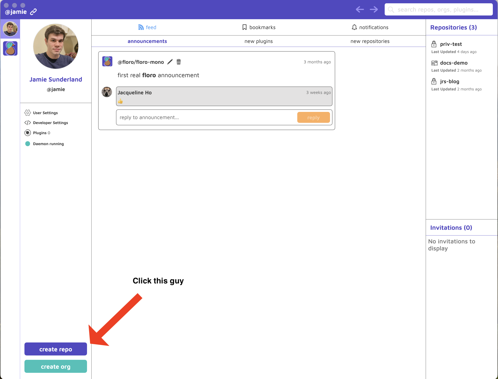


Give your repo a name and create it


With the desktop client running, click the following link (this won't work on safari), <a href="https://floro.io/app-proxy/repo/@/floro/next-demo?from=remote">floro next demo repo</a>. Alternatively, you can search for the repo "next-demo" in the floro search bar in the upper right corner.


Choose the repository you want to copy into (in this example, it is @jamie/docs-demo).


Select all the plugins, DO NOT CHOOSE manual copy (if you're curious what that does <a href="https://floro.io/docs">read the docs</a>).


Now, click paste into.


You've now copied over all the state from the demo to your repo. Now we need to commit it. click on the compare icon.

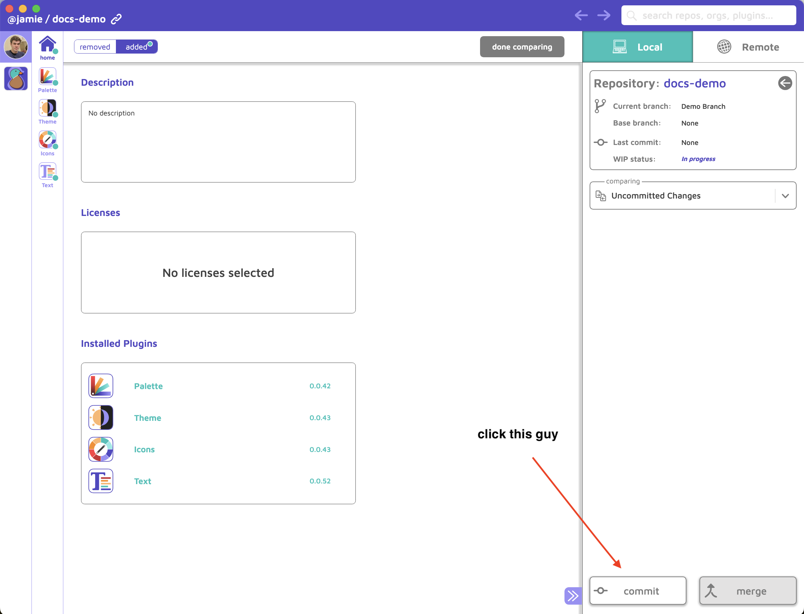

Commit your state

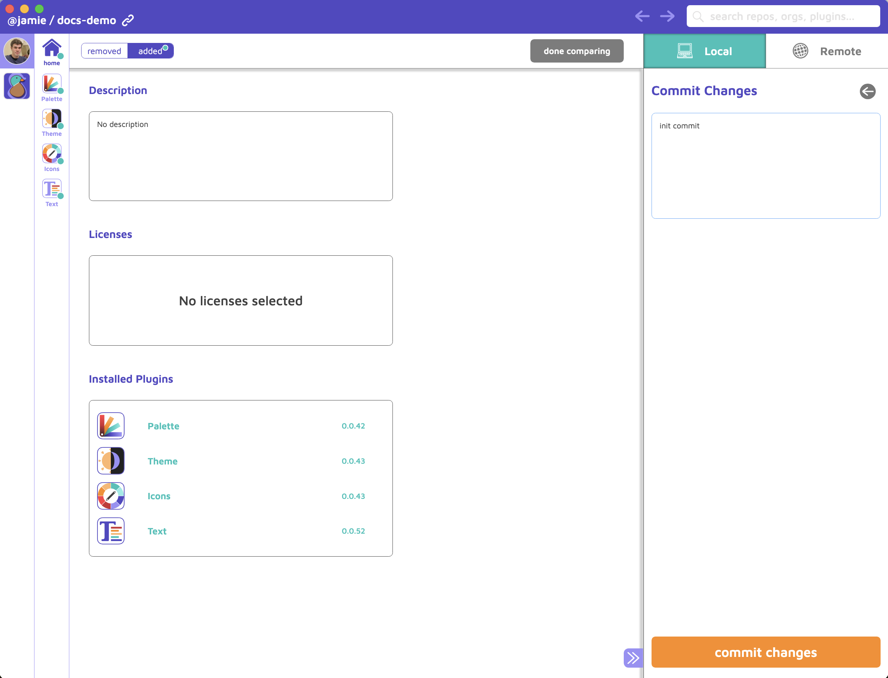

After you write a commit message and commit your changes, we're finally ready to get back to the code! Almost there!

## Connecting your project with your Floro repository

Open up `floro_infra/floro.module.js` and modify the code to point to your Floro repository

```js
const paletteGenerator = require("@floro/palette-generator");
const themesGenerator = require("@floro/themes-generator");
const iconGenerator = require("@floro/icon-generator");
const textGenerator = require("@floro/text-generator")

module.exports = function () {
  return {
    //repository: "@floro/next-demo",
    repository: "@jamie/docs-demo", //change this to the name of your repository
    generators: [
      {
        generator: iconGenerator,
        args: {
          lang: "typescript",
        },
      },
      {
        generator: themesGenerator,
        args: {
          lang: "typescript",
        },
      },
      {
        generator: paletteGenerator,
        args: {
          lang: "typescript",
        },
      },
      {
        generator: textGenerator,
        args: {
          lang: "typescript",
        },
      },
    ],
  };
};
```

running `floro module help` should produce the following
```bash

floro module

Build application state from repository

Commands:
  floro module sync     syncs meta.
  floro module build    builds application state from floro repository
  floro module watch    watch floro state and rebuild
  floro module current  use current state and rebuild

Options:
      --version     Show version number                                [boolean]
      --help        Show help                                          [boolean]
  -m, --module      specify the floro module script
                                           [string] [default: "floro.module.js"]
  -k, --remote-key  specify a remote api key to pull with (only needed if logged
                    out)                                                [string]
  -l, --local       syncs meta state from local repository branch      [boolean]

```

#### Now run
```bash
# cwd = <your_project_root>/floro_infra
floro module sync -l -b
```

This tells floro to pull the most recently committed state from your (-l flag for local) local repo from the main branch. (You can pull from branches other than main but that's beyond the scope of this setup). The command then builds the state into the typescript code that can be consumed (-b flag for build) by your application.

<i>This is the same thing as doing</i>
```bash
floro module sync -l
floro module build
```

Normally, we don't need the -l flag since we pull our state from the remote repository. However, if you haven't pushed your floro repo yet that won't work.


To confirm the command worked open up `floro_infra/meta.floro.json`

```json
{
  "moduleFile": "floro.module.js",
  "repositoryId": "7810bda0-e032-49c2-8f4a-bb4b5edb4bf7",
  "sha": "9b92c9efce68e8984610075ff958a93c7bf1098e882406bee5dcbb195072b03a",
  "message": "init commit", // this should be the commit message you just made
  "idx": 1,
  "generatorDependencies": {
    "icon-generator": {
      "icons": "0.0.43"
    },
    "themes-generator": {
      "theme": "0.0.40"
    },
    "palette-generator": {
      "palette": "0.0.39"
    },
    "text-generator": {
      "text": "0.0.32"
    }
  }
}

```

The floro_infra/meta.floro.json should be committed to git (not git ignored). However, it is generated code and should not be manually altered. Resolve git conflicts on it with `floro module sync -b`.

## API Overview

### Styles

### Text

The best way to get the hang of the Text api is to look at the code in `src/app/string-examples/StringExamples.tsx`.

below is the complete set of options for working with the rich text api
```typescript
export interface RichTextProps<T extends keyof PhraseKeys | unknown> {
  onClickLink?: (
    linkName: T extends keyof PhraseKeys
      ? keyof PhraseKeys[T]["links"]
      : string,
    linkHref: string
  ) => void; // this is used when your text contains link references, you should always handle links with switch statements
  linkColor?: ColorValue; // you can override the default link color you set here
  styledContent?: {
    [Property in keyof (T extends keyof PhraseKeys
      ? PhraseKeys[T]["styleClasses"]
      : object)]: string | undefined;
  };
  // when you create a styledClass in floro you can automatically define the corresponding styledContent class to use here
}

```

### You're done integrating the APIs🎉! You're still pointing at the wrong floro repository but we'll fix that in second.

### API Demo

The entire API is typesafe and provides excellent autocompletion for IDEs that support auto-completion.

Please see the <a href="https://floro.io/docs">Floro Docs</a> for an in depth review of each of the plugins.

## Eliminating what we don't need

Open up `src/app/floro_infra/contexts/FloroMount.tsx`

If you don't need one of the features listed above, delete the provider(s) and remove all references to the deleted provider(s). You can also eliminate the generators from `floro.module.js` and their corresponding npm dependencies.

```tsx
import React from "react";

import { FloroDebugProvider } from "./FloroDebugProvider";
import { FloroTextProvider } from "./text/FloroTextContext";
import { FloroLocalesProvider } from "./text/FloroLocalesContext";
import { FloroConnectionProvider } from "./FloroConnectionProvider";
import { FloroPaletteProvider } from "./palette/FloroPaletteProvider";
import ThemeMount from "./themes/ThemeMount";
import { FloroIconsProvider } from "./icons/FloroIconsProvider";

interface Props {
  children: React.ReactElement;
}

const FloroMount = (props: Props) => {
  return (
    <FloroDebugProvider> // Not needed if you don't want offline live edits
      <FloroPaletteProvider> // Not needed if not using palette
        <ThemeMount initTheme={props.initThemePreference}> // Not needed if not using themes
          <FloroIconsProvider> // Not needed if not using icons
            <FloroTextProvider text={props.text} cdnHost={props.cdnHost} localeLoads={props.localeLoads} > // Not needed if not using text
              <FloroLocalesProvider initLocaleCode={props.initLocaleCode}> // Not needed if not using text
                {props.children}
              </FloroLocalesProvider>
            </FloroTextProvider>
          </FloroIconsProvider>
        </ThemeMount>
      </FloroPaletteProvider>
    </FloroDebugProvider>
  );
};

export default FloroMount;

```


## Syncing your Strings with your Remote Floro Repository
#### (skip this if you don't need the text plugin or you don't want real time string updates)

Floro allows you to make live updates to your string content without requiring any code OTA tools. It also can do this safely because of some static analysis we perform on the code when you compile it. This can be hugely valuable for you and your team, since you can make instant changes to your production string copy without needing to produce a new build.

### Example of string safe updates

Imagine in Floro we have two phrases

```
Phrase 1)
Phrase Key: welcome_banner
Phrase Value: "welcome to our website"

Phrase 2)
Phrase Key: cart_total
Phrase Value: "you have {n} items in your shopping cart"

```

We could imagine the generated code from floro as being something like

```
Phrase 1)
function welcome_banner() {
  return "welcome to our website"
}

Phrase 2)
function cart_total(n: number) {
  return  `you have {n} items in your shopping cart`;
}
```

An even simpler way to imagine it is by the function signatures

```bash
Phrase 1)
welcome_banner()
Phrase 2)
cart_total(n: number)
```

As long as the signatures of a phrase match, we can assume it is safe to update the implementation details. When there is an update, we just update the strings where the signatures match exactly.

If you look at the file `src/app/floro_infra/floro_modules/text-generator/static-structure.json`, you'll see the following JSON

```json
{
  "structure": {
    "string_examples.enter_gender_input_placeholder": {},
    "string_examples.numbers,_dates,_currency,_&_lists": { "title": "string" },
    "string_examples.enter_place": {},
    "string_examples.enter_number_of_files_placeholder": {},
    "string_examples.pluralization_and_grammar": {
      "gender": "",
      "genderInputContent": "string",
      "inputContent": "string",
      "numberOfFiles": 0,
      "place": 0,
      "placeInput": "string",
      "placeSuffix": "",
      "smallTitle": "string",
      "title": "string"
    },
    "string_examples.enter_url_input_placeholder": {},
    "string_examples.inserting_content": {
      "code": "string",
      "inputContent": "string",
      "title": "string"
    },
    "string_examples.handling_links": { "code": "string", "title": "string" },
    "string_examples.string_overview": { "code": "string", "title": "string" },
    "string_examples.string_examples_title": {},
    "language_selector.select_a_language": {},
    "debug_modal.debug_setup_instructions": {},
    "debug_modal.edit_mode": {},
    "debug_modal.debug_mode": {},
    "debug_modal.connecting": {},
    "debug_modal.grant_camera_permission": {},
    "debug_modal.disconnect": {},
    "debug_modal.cancel": {},
    "debug_modal.repo_not_found": {},
    "debug_modal.floro_connected_title": {},
    "home_screen.debug_mode_unlocked": {},
    "home_screen.view_string_examples": {},
    "home_screen.tap_to_unlock_debug": { "remainingTaps": 0 },
    "home_screen.welcome_to_demo": {},
    "header.debug_floro": {}
  },
  "hash": "e10ed366"
}

```

This is the signature table of all the phrases used in the demo app.

Once, we have this table for our app, we can allow anyone on our team to delete the <b>cart_total</b> phrase and update the value of the <b>welcome_banner</b> phrase without having to worry if we broke our application. This is great since we can make updates to our future builds without compromising on real time updates to our existing (live) build.

To produce this though we need to find all the instances of the source code that call `useRichText`, `usePlainText`, and `getText` and then record the interfaces of all the method signatures. For this we need to use the `ts-morph` library to search our AST.

### Post Processing

When we run `floro module build` or `floro module sync -b`, floro will look and see if there is a file next to `floro.module.js` called `postprocess.floro.js`


The only post-processing file you may need to update is `src/app/floro_infra/scripts/text/phrase-static-analysis.js`

```js
const { Project, SyntaxKind } = require("ts-morph");
const path = require('path');
const fs = require('fs');

/**
 * Make sure this points to your root front-end tsconfig
 */
const tsConfigFilePath =  path.join(__dirname, "../../../tsconfig.json"); // if for some reason your tsconfig is not in your root, udpate this path
const project = new Project({
    tsConfigFilePath
  });

project.resolveSourceFileDependencies();
const languageService = project.getLanguageService();

const phraseKeys = new Set();
const localesHooksPath =  path.join(__dirname, "../../hooks/text.tsx");
const localesHooks = project.getSourceFile(localesHooksPath);

const useRichTextNode = localesHooks.getVariableDeclaration('useRichText');
const useRichTextSourceRefs = languageService.findReferences(useRichTextNode.getNameNode());
for (const sourceRef of useRichTextSourceRefs) {
  const refs = sourceRef.getReferences();
  for (const ref of refs) {
    const callee = ref.getNode().getParentIfKind(SyntaxKind.CallExpression);
    if (callee) {
      const args = callee.getArguments();
      const keyArg = args[0].getText();
      phraseKeys.add(unescapePhraseKey(keyArg));
    }
  }
}

const usePlainTextNode = localesHooks.getVariableDeclaration('usePlainText');
const usePlainTextSourceRefs = languageService.findReferences(usePlainTextNode.getNameNode());
for (const sourceRef of usePlainTextSourceRefs) {
  const refs = sourceRef.getReferences();
  for (const ref of refs) {
    const callee = ref.getNode().getParentIfKind(SyntaxKind.CallExpression);
    if (callee) {
      const args = callee.getArguments();
      const keyArg = args[0].getText();
      phraseKeys.add(unescapePhraseKey(keyArg));
    }
  }
}

const localesStatic = JSON.stringify(Array.from(phraseKeys), null, 2);
fs.writeFileSync(
  path.join(__dirname, "../../floro_modules/text-generator/locales.static.json"),
  localesStatic,
  "utf-8"
);

function unescapePhraseKey(token) {
  return token.substring(1, token.length - 1);
}
```

### Warning!!! DO NOT ABSTRACT ON TOP OF `useRichText` or `usePlainText` or `getText`

Do not pass variable values into these methods.

<b>Good ✅</b>

```tsx

const myString = usePlainText("my.string")

return (
  <View>
    <Text>{myString}</Text>
  </View>
)

```

<b>Bad ❌</b>

```tsx

const myStringKey = "my.string";
const myString = usePlainText(myStringKey); // this will not be caught in static analysis and will break things!

return (
  <View>
    <Text>{myString}</Text>
  </View>
)

```


## Syncing Text

In order to sync text in production we need to make a webhook that makes an API call when the user opens the app to check the commit state of the remote <b>main</b> branch on floro.

## Remote API Key (Prerequisite)

1) Depending on if your repository is a personal or organization, navigate in floro either to your home dashboard or the organization dashboard.

2) In either case click `Developer Settings`


3) Create a Remote API Key

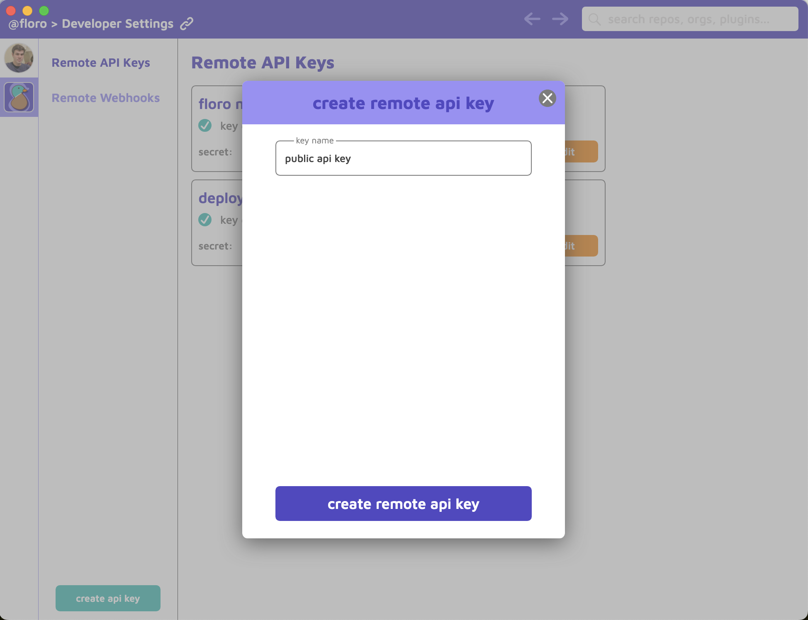

4) Navigate to your remote repo

5) Click "remote settings"

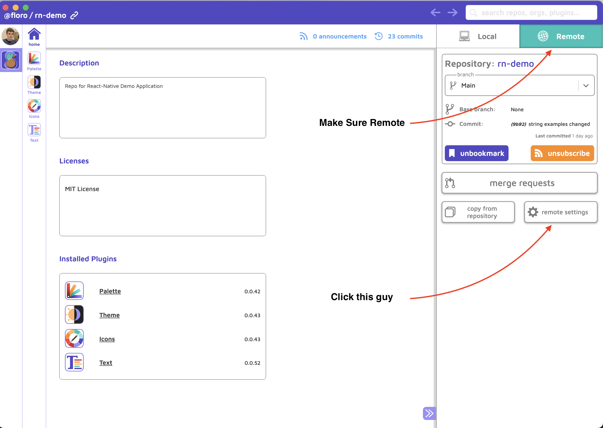

6) Click "Configure API Settings"

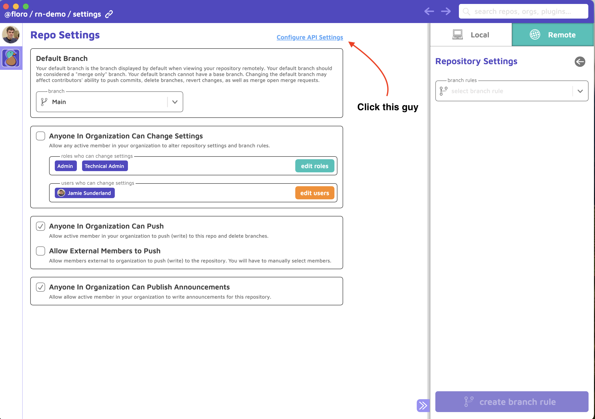

7) Enable the remote key

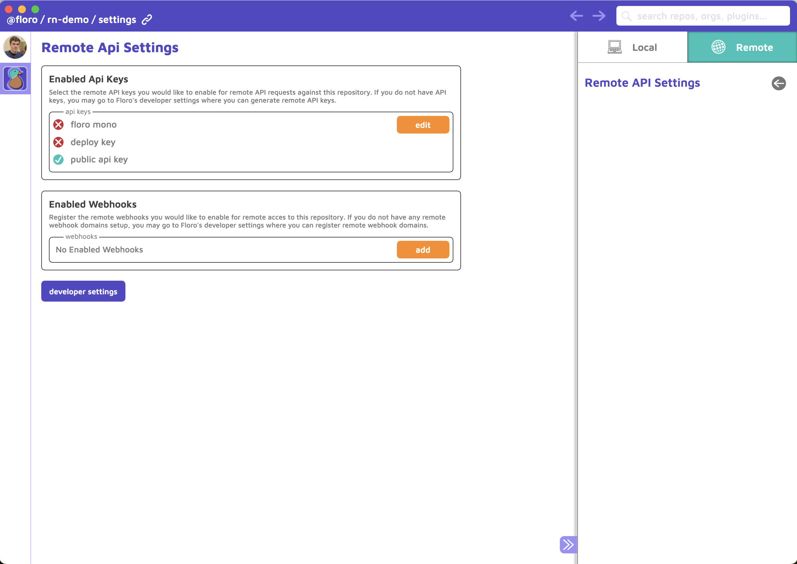


### Developing with Floro

For developers, we recommend avoiding branches and pushing to and pulling from main directly. I know, this sounds like advice that breaks everything you know about good version control hygiene but it's the simplest approach to dealing with submoduled system designs and makes the collaborative experience far simpler. This does mean you will be merging and resolving floro merge conflicts locally, not in merge requests. Remember, floro state is data, not code, it's easy to over analogize floro to git. Structured version control does not have the same risks as plain text version control.

Whatever the case may be you, if you are adding content to floro and developing features in tandem, you will need to your floro changes to end up in your main floro branch before you can merge your git changes into your git main branch.

#### (Re)Building your WIP

The command you will run all the time is `floro module current` from the `floro_infra` directory or `floro module current -m floro_infra/floro.module.js` from the root of your project.

This builds your current <i>work in progress</i> state without changing the `meta.floro.json` file. Just remember to commit and push to floro before pushing to git.

#### Avoid Hot Change Reloading

Floro has a command `floro module watch` that you can run from the `floro_infra` directory to allow your floro_modules to rebuild with each change you make to your local floro repository. This is a good feature for runtimes that don't support HMR but is very annoying if your app does support HMR. It is a way better experience to just use the floro debug socket. Use `floro module current` to update your floro_modules.


#### To gitignore floro_modules or to not gitignore floro_modules (CI considerations)

We recommend gitignoring floro_modules. However, if you are a solo developer, it may be easiest to just commit your floro_modules.

If you do gitignore your floro_modules you may have to do some CI work to add pulling floro module state to your CI workflow. Please see the <a href="https://floro.io/docs">floro docs</a>.


### Your README.md


You should include the following setup step in your project documentation

```bash
npm install # or yarn
npm install -g floro
floro module sync -b -m src/app/floro_infra/floro.module.js
```