# Floro NextJS Demo App

This repository should serve as both a demo and a guide for integrating Floro into your own application. This demo is built with Next 14, but you should be able to use this as a guide to integrate into nearly any node-based server application. It is easiest to get the demo to work first and then copy parts of the demo code into your own application.

## Getting the Demo to work

You will need the floro cli to build the floro modules

```bash
npm install -g floro
```

#### System Prerequisites
Built with node v19.9.0

#### Setup

```bash
yarn
```

```bash
floro module build -m src/app/floro_infra/floro.module.js
```

```bash
yarn dev
```

### Install Floro
If you want to actually experience the demo in full, please download the Floro Desktop app from [Floro](https://floro.io) if you haven't already

### Add the Chrome Extension
[Add Floro Extension](https://chromewebstore.google.com/detail/floro/eimdhkkmhlaieggbggapcoohmefbnlkh)

#### Clone the Floro Repository in Floro
Next clone the repository for this project
[Clone Floro Repo Here](https://github.com/florophore/floro-next-demo).

(This will only work when the Floro desktop client is running)

### Create a Local API Key in Floro
Click developer settings once you are logged into Floro


Click on "create api key" (the green button in the lower left). Name your key whatever you want!


### Attach the API Key to the next-demo repository

[Open the @floro/next-demo Repo Here](https://floro.io/app-proxy/repo/@/floro/next-demo?from=local).


Click on the "local settings" tab


Enable the Local API Key you created in the previous step


From the chrome extension popup, enter the secret of the (local) api key you connected to the repo in the previous step.

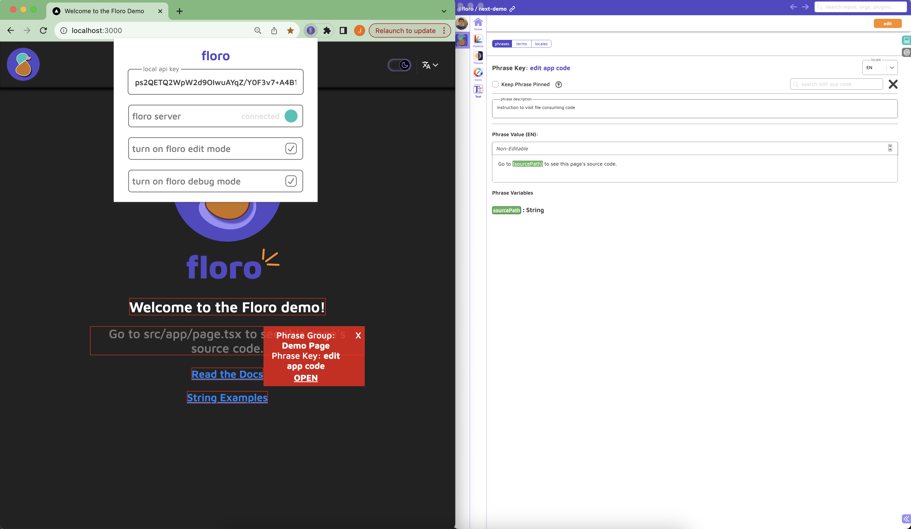

If you click "turn on floro edit mode". You should be able to start freely editing the page content without needing to edit any code.

### System Design of Floro Text Updates

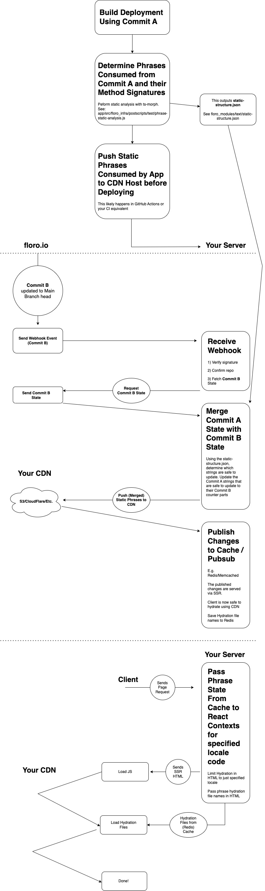

Note: By hydration files, we are referring to phrase translations you do not need immediately (they appear under `public/locales/` after a floro build). For example, if you request a page with the spanish cookie specified, the chinese phrases will not be included in the initial page html. When the javascript loads, the phrases for the languages not present in the initial page request will be fetched from your CDN. See `src/app/floro_infra/contexts/text/FloroTextContext.tsx`

<i>Dislaimer: Due to the limitations of how Next serializes context props in SSR and the inability to double render in layouts, it is not possible to filter the returned keys to only the keys required by the page being rendered in the SSR html. In other words, every time you make a page request, you are returning the entire collection of phrases your application consumes (for the preferred locale). This is an unfortunate side effect of a very leaky SSR abstraction (Next is really designed for SSG not SSR) that not even static analysis or RSC can save us from.  For the vast majority of applications this is likely not a problem, especially if you are supplementing floro with something like a headless CMS. However, if this poses a problem for you there are two options. 1) Forgo real time floro updates (In this case, you may remove the cache and CDN aspects described in the system design). 2) Switch to an alternative framework that allows for manual hydration with SSR (e.g. Remix, Express/Vite)</i>.

<i>Please note: This problem is not limited to Floro but would exist for any i18n solution that provided a mechanism for live string updates.</i>

<i>Also shameless plug: If your team is reaching the point where you realize its time to get off of Next but don't know what to do, consider hiring me, I'm really good at building robust SSR frameworks.</i>

### Third Party API Keys

The plugins shown in this application that interact with APIs are all BYOK.

All API Keys are stored client side (on your machine) and never on the Floro servers. We do have to send your third party API keys in requests to our servers to overcome CORS limitations from DeepL and OpenAI. The controller code for the ML APIs can be found here <a href="https://github.com/florophore/floro-mono/blob/main/packages/backend/src/controllers/proxy/ChatGPTController.ts">ChatGPTController.ts</a> and here <a href="https://github.com/florophore/floro-mono/blob/main/packages/backend/src/controllers/proxy/DeepLProxyController.ts">DeepLProxyController.ts</a>. They are also only accessible by the text plugin (as shown in the demo). Every plugin has it's own version of local storage that can be cleared by you.

If you want to play around with translating between languages, you will need a DeepL API Key (they offer a free plan that works with Floro if you don't already have an account). See the <a href="https://support.deepl.com/hc/en-us/articles/360020695820-Authentication-Key">DeepL API Key docs</a>.

If you want to play around with the ChatGPT features (this includes automatic pluralization & genderization, term detection, as well as general suggestion prompting), you will need to supply your own OpenAI API key. See the <a href="https://platform.openai.com/docs/quickstart?context=curl">OpenAI Api Key docs</a>.


### Plugin Documentation

For documentation focused specifically on the plugins Demonstrated in this demo, please consult the <a href="https://floro.io/docs">Floro Documentation</a>.


## Integrating Floro Into Your Project

If you're convinced you're ready to test Floro out in your own application you need to take a couple of things into consideration.

Floro can be incrementally integrated into your app. I strongly recommend not converting your entire project in one giant PR.


### What plugin features do you want/need?

There are some features not explicitly demonstrated in the demo. You can, for example, make your app checks for new translations every time it launches and update the strings (that are SAFE TO UPDATE) if they are on the <b>main floro remote branch head</b>.

- ### Palette
  - Do you want to be able to change every color in your app? I do not personally use this feature in the floro.io website but there may be some benefit if you have a designer on your team who changes colors often or if you have an expansive color palette. This is mostly an upstream plugin dependency but does not need to be included as a generator at runtime (for most apps).

- ### Themes
  - Do you want to use the theme colors provided by the floro themes plugin (you can still have themed SVG icons, without needing to use floro themes in your application). You can easily use themes inline or create css variables (as we have done in this demo).

- ### Icons
  - Icons are really useful because they can be themed fairly complexly. You can also make your icons have color state variants, e.g. the icon colors change when an icon is hovered or pressed down.

- ### Text
  - Text is probably my favorite plugin. It's also the only plugin I would consider live production updates a good idea for. The integration effort is slightly different for Text than the other 3 plugins.


### What node Dependencies do you need?

- `ts-morph` (dev dep)
    - Only needed if you need live production updates from a floro main branch. Why? We need to do static analysis when syncing text at build time, in order to determine which strings are safe to update when a live production update occurs.
- `crypto`
    - Only needed if you want to receive webhook notifications when a floro branch updates. If you have a different hmac library already installed that is fine.
- `@floro/palette-generator`
    - Needed for floro palette
- `@floro/themes-generator`
    - Needed for floro themes
- `@floro/icons-generator`
    - Needed for floro icons
- `@floro/text-generator`
    - Needed for floro text


## Integrating the Code

The easiest thing to do is just copy the entire floro_infra directory from the (src/app) directory of this repo into the (src/app) of your project. If you need help reach out to me on <a href="https://discord.com/invite/VJ8Mhjd9Gw">discord</a>, I'll do my best to respond ASAP. We can hop on a zoom call if you get stuck.


```bash
cp -R ./src/app/floro_infra <path/to/your_project/top_level_directory>/src/app/floro_infra
```

## Pointing at your Floro Repo


Before we start ripping things out, we should make sure everything builds correctly. To do that run the following

```bash
# cwd = project root
cd src/app/floro_infra
floro module sync -b
```

If you see
```bash
synced repo and wrote meta file to /path/to/repo/YourAppName/src/app/floro_infra/meta.floro.json
running post process..
build succeeded!
```
Then we are good! Hopefully you're already on a branch but if not, make a branch and commit here (in git).

Let's proceed!

### Create a Floro Repository (if you haven't already)

If you are working on your project on behalf of an organization and intend to have multiple collaborative stakeholders, you should probably start an organization in floro and create the repository under the organization's account. At the time of writing this repositories cannot be transferred (they can be copied though). If you are a solo developer and don't expect to need to give edit permission to many others, feel free to create a personal repository. All personal and public (including organization) repositories are free of charge without any feature restrictions on floro.io, no payment details required.

From either your "home dashboard" or your "organization's dashboard" click <b>create repository</b> in the lower left hand corner of the screen.


Give your repo a name and create it


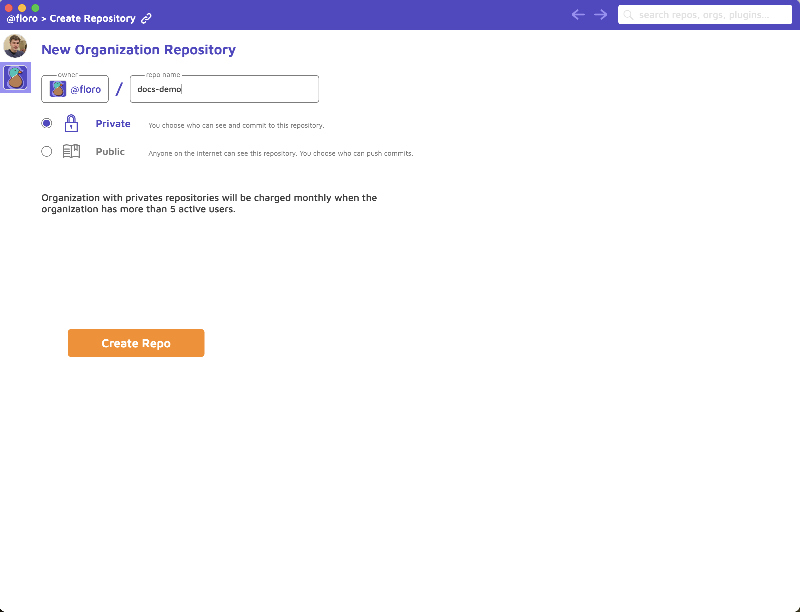

With the desktop client running, click the following link (this won't work on safari), <a href="https://floro.io/app-proxy/repo/@/floro/next-demo?from=remote">floro next demo repo</a>. Alternatively, you can search for the repo "next-demo" in the floro search bar in the upper right corner.


Choose the repository you want to copy into (in this example, it is @jamie/docs-demo).


Select all the plugins, DO NOT CHOOSE manual copy (if you're curious what that does <a href="https://floro.io/docs">read the docs</a>).

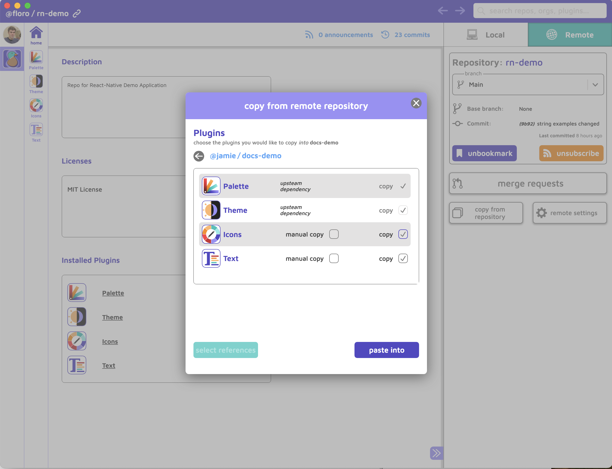

Now, click paste into.


You've now copied over all the state from the demo to your repo. Now we need to commit it. click on the compare icon.


Commit your state


After you write a commit message and commit your changes, we're finally ready to get back to the code! Almost there!

## Connecting your project with your Floro repository

Open up `floro_infra/floro.module.js` and modify the code to point to your Floro repository

```js
const paletteGenerator = require("@floro/palette-generator");
const themesGenerator = require("@floro/themes-generator");
const iconGenerator = require("@floro/icon-generator");
const textGenerator = require("@floro/text-generator")

module.exports = function () {
  return {
    //repository: "@floro/next-demo",
    repository: "@jamie/docs-demo", //change this to the name of your repository
    generators: [
      {
        generator: iconGenerator,
        args: {
          lang: "typescript",
        },
      },
      {
        generator: themesGenerator,
        args: {
          lang: "typescript",
        },
      },
      {
        generator: paletteGenerator,
        args: {
          lang: "typescript",
        },
      },
      {
        generator: textGenerator,
        args: {
          lang: "typescript",
        },
      },
    ],
  };
};
```

running `floro module help` should produce the following
```bash

floro module

Build application state from repository

Commands:
  floro module sync     syncs meta.
  floro module build    builds application state from floro repository
  floro module watch    watch floro state and rebuild
  floro module current  use current state and rebuild

Options:
      --version     Show version number                                [boolean]
      --help        Show help                                          [boolean]
  -m, --module      specify the floro module script
                                           [string] [default: "floro.module.js"]
  -k, --remote-key  specify a remote api key to pull with (only needed if logged
                    out)                                                [string]
  -l, --local       syncs meta state from local repository branch      [boolean]

```

#### Now run
```bash
# cwd = <your_project_root>/src/app/floro_infra
floro module sync -l -b
```

This tells floro to pull the most recently committed state from your (-l flag for local) local repo from the main branch. (You can pull from branches other than main but that's beyond the scope of this setup). The command then builds the state into the typescript code that can be consumed (-b flag for build) by your application.

<i>This is the same thing as doing</i>
```bash
floro module sync -l
floro module build
```

Normally, we don't need the -l flag since we pull our state from the remote repository. However, if you haven't pushed your floro repo yet that won't work.


To confirm the command worked open up `floro_infra/meta.floro.json`

```json
{
  "moduleFile": "floro.module.js",
  "repositoryId": "7810bda0-e032-49c2-8f4a-bb4b5edb4bf7",
  "sha": "9b92c9efce68e8984610075ff958a93c7bf1098e882406bee5dcbb195072b03a",
  "message": "init commit", // this should be the commit message you just made
  "idx": 1,
  "generatorDependencies": {
    "icon-generator": {
      "icons": "0.0.43"
    },
    "themes-generator": {
      "theme": "0.0.40"
    },
    "palette-generator": {
      "palette": "0.0.39"
    },
    "text-generator": {
      "text": "0.0.32"
    }
  }
}

```

The floro_infra/meta.floro.json should be committed to git (not git ignored). However, it is generated code and should not be manually altered. Resolve git conflicts on it with `floro module sync -b`.

### You're done integrating the APIs🎉!

### API Demo

The entire API is typesafe and provides excellent autocompletion for IDEs that support auto-completion.

Please see the <a href="https://floro.io/docs">Floro Docs</a> for an in depth review of each of the plugins.

## Themes & Palette

(light theme)

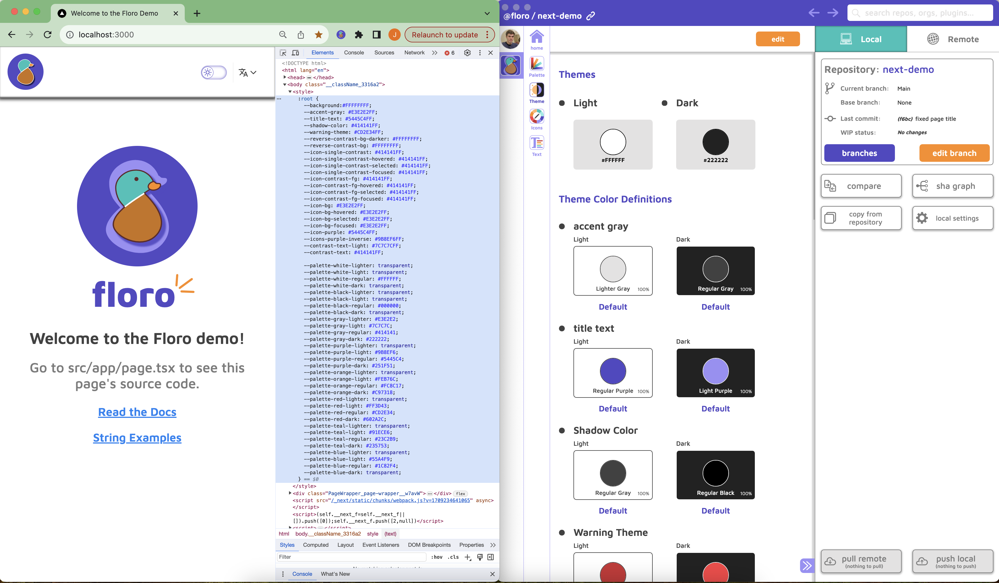

(dark theme)

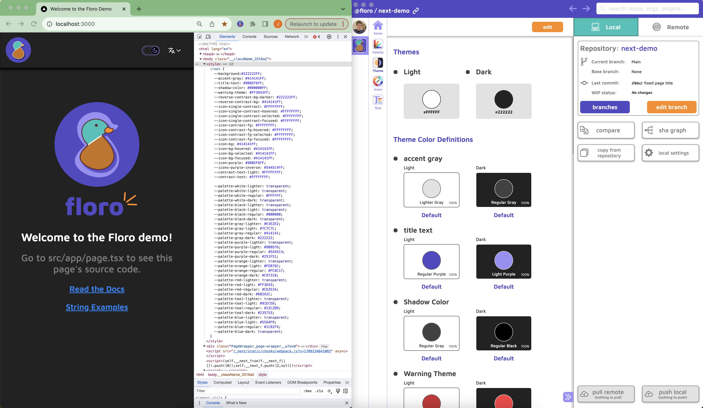

The theme and palette contexts will produce global css variables, to modify this behavior you can edit `src/app/Body.tsx`

You're then able to use the variables in your css like so

```css

/* see global.css */
body {
  background: var(--background);
  color: var(--contrast-text);
  padding: 0;
  margin: 0;
}

/* see Home.module.css */
.link {
    color: var(--palette-blue-regular);
    font-size: 1.44rem;
    font-weight: 600;
    text-align: center;
}
```

You're also able to access your palette and themes in any component. `src/app/components/ThemeSwitcher/index.tsx` has an example of this

(Palette Example)

``` typescript
  const { currentTheme, selectColorTheme } = useThemePreference();
  const palette = useFloroPalette();

  const isLight = useMemo(() => {
    return currentTheme == "light";
  }, [currentTheme]);
```

(Theme Example with Variant States)

``` typescript
  const isHovered = useState(false);
  const iconColor = useThemedColor("icon-single-contrast", isHovered ?  "hovered" : "default");
```
You can add variant states to your themes (e.g. "hover", "focus", "selected", "Etc."). These states can also be accessed in css vars.

You can add your own theme determination logic or use the theme prefence selector that comes with floro.
``` typescript
  const { currentTheme, selectColorTheme } = useThemePreference();
```


## Icons (SVGs)

Floro also allows designers to  add svgs to the codebase without having to go through git or any engineering processes. In addition Icons can be themed and use state variants as well.

(light theme)

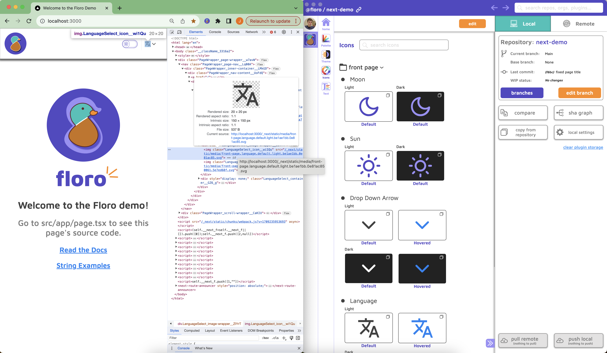

(dark theme)

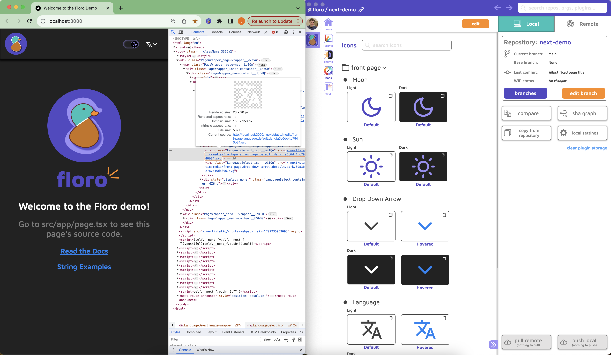

This makes color refactors a breeze since all of the SVGs are mapped to your floro palette and theme map.

What does the icon api look like? The LanguageSelect gives a good example see `src/app/components/LanguageSelect/index.tsx`

```typescript
  const [isHovered, setIsHovered] = useState(false);

  const langIcon = useIcon(
    "front-page.language",
    isHovered ? "hovered" : undefined
  );
  const dropdownIcon = useIcon(
    "front-page.drop-down-arrow",
    isHovered ? "hovered" : undefined
  );

  const { selectedLocaleCode, setSelectedLocaleCode } = useFloroLocales();
  ...

  return (
    ...
      <div
        className={styles["image-wrapper"]}
        onMouseEnter={() => setIsHovered(true)}
      >
        
        
      </div>
    ...
  )
```

## Text
The best way to get the hang of the Text API is to look at the code in `src/app/string-examples/StringExamples.tsx`.

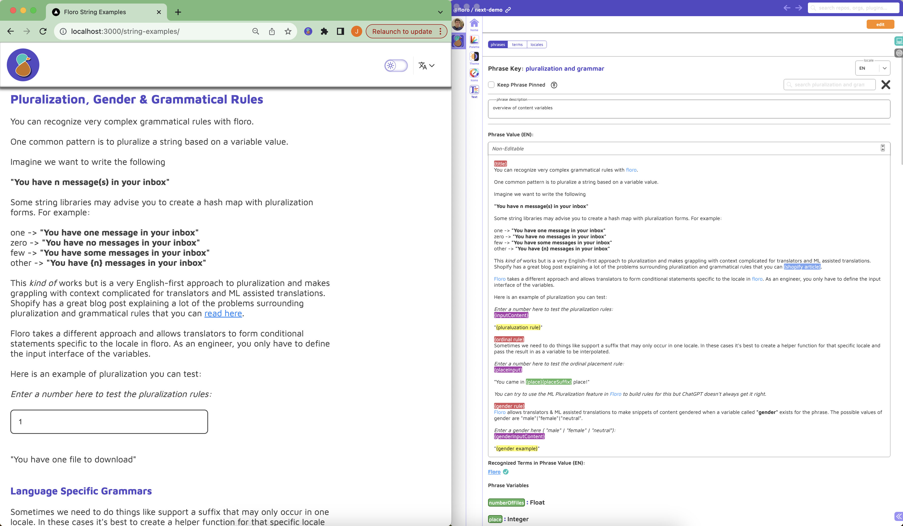

The corresponding typescript looks like the following

```typescript
// we use rich text for component strings
const PluralizationAndGrammar = useRichText(
  "string_examples.pluralization_and_grammar"
);

...

const onPressShopifyLinkExample = useCallback(
  (
    linkName: keyof PhraseKeys["string_examples.pluralization_and_grammar"]["links"],
    linkHref: string
  ) => {
    if (linkName == "shopify article") {
      window.open(linkHref, "_blank");
    }
  },
  []
);

const [gender, setGender] = useState("female");
// we use plain text for the placeholder
const enterGenderInput = usePlainText(
  "string_examples.enter_gender_input_placeholder"
);

const renderTitle = useCallback((content: React.ReactElement) => {
  return <h2 className={styles["example-title"]}>{content}</h2>;
}, []);

const renderSmallTitle = useCallback((content: React.ReactElement) => {
  return <h3 className={styles["example-small-title"]}>{content}</h3>;
}, []);

return (
  ...
    <PluralizationAndGrammar
      title={renderTitle}
      smallTitle={renderSmallTitle}
      richTextOptions={{
        linkColor: palette?.blue.regular ?? "blue",
        onClickLink: onPressShopifyLinkExample,
      }}
      inputContent={
        <>
          <input
            className={styles["input"]}
            type="text"
            value={numberOfFilesString}
            onChange={(event) => {
              setNumberOfFiles(event.target.value);
            }}
            placeholder={enterNumberOfFilesPlaceholder}
          />
        </>
      }
      gender={gender}
      numberOfFiles={numberOfFiles}
      place={place}
      placeSuffix={placeSuffix}
      genderInputContent={
        <>
          <input
            className={styles["input"]}
            type="text"
            value={gender}
            onChange={(event) => {
              setGender(event.target.value);
            }}
            placeholder={enterGenderInput}
          />
        </>
      }
      placeInput={
        <>
          <input
            className={styles["input"]}
            type="text"
            value={placeString}
            onChange={(event) => {
              setPlaceString(event.target.value);
            }}
            placeholder={enterPlacePlaceholder}
          />
        </>
      }
    />
  ...
)

```

below is the complete set of options for working with the rich text api
```typescript
export interface RichTextProps<T extends keyof PhraseKeys | unknown> {
  onClickLink?: (
    linkName: T extends keyof PhraseKeys
      ? keyof PhraseKeys[T]["links"]
      : string,
    linkHref: string
  ) => void; // this is used when your text contains link references, you should always handle links with switch statements
  linkColor?: ColorValue; // you can override the default link color you set here
  styledContent?: {
    [Property in keyof (T extends keyof PhraseKeys
      ? PhraseKeys[T]["styleClasses"]
      : object)]: string | undefined;
  }; // when you create a styledClass in floro you can automatically define the corresponding styledContent class to use here
}

```


## Eliminating what we don't need

Open up `src/app/floro_infra/contexts/FloroMount.tsx`

If you don't need one of the features listed above, delete the provider(s) and remove all references to the deleted provider(s). You can also eliminate the generators from `floro.module.js` and their corresponding npm dependencies.

```tsx
import React from "react";

import { FloroDebugProvider } from "./FloroDebugProvider";
import { FloroTextProvider } from "./text/FloroTextContext";
import { FloroLocalesProvider } from "./text/FloroLocalesContext";
import { FloroConnectionProvider } from "./FloroConnectionProvider";
import { FloroPaletteProvider } from "./palette/FloroPaletteProvider";
import ThemeMount from "./themes/ThemeMount";
import { FloroIconsProvider } from "./icons/FloroIconsProvider";

interface Props {
  children: React.ReactElement;
}

const FloroMount = (props: Props) => {
  return (
    <FloroDebugProvider> // Not needed if you don't want offline live edits
      <FloroPaletteProvider> // Not needed if not using palette
        <ThemeMount initTheme={props.initThemePreference}> // Not needed if not using themes
          <FloroIconsProvider> // Not needed if not using icons
            <FloroTextProvider text={props.text} cdnHost={props.cdnHost} localeLoads={props.localeLoads} > // Not needed if not using text
              <FloroLocalesProvider initLocaleCode={props.initLocaleCode}> // Not needed if not using text
                {props.children}
              </FloroLocalesProvider>
            </FloroTextProvider>
          </FloroIconsProvider>
        </ThemeMount>
      </FloroPaletteProvider>
    </FloroDebugProvider>
  );
};

export default FloroMount;

```

# Update your RootLayout

Your root layout should look something like this now. You do not need the `Body` component unless you want css vars generated from Floro.

```typescript
export default async function RootLayout(props: { children: React.ReactNode }) {
  // this does not need to be a cookie, it can come from next's routing logic. Just make sure the localeCodes map correctly
  const localeCode = (cookies().get("NEXT_LOCALE")?.value ||
    "EN") as keyof LocalizedPhrases["locales"] & string;
  // You can use whatever mechanis you like for determining the theme preference. The theme cookie is not necessary
  const themePreference = cookies().get("NEXT_THEME_PREFERENCE")?.value as
    | undefined
    | (keyof ThemeSet & string);
  // This is the names of the phrase files for the JS to preload from your CDN after init page load
  const localeLoads = FloroTextStore.getInstance().getLocaleLoads();
  // this is the global text object
  const text = FloroTextStore.getInstance().getText();
  const cdnHost = ""; // IN PROD THIS SHOULD BE THE URL TO YOUR ASSET CDN/SERVER

  return (
    <FloroMount
      initLocaleCode={localeCode}
      cdnHost={cdnHost}
      localeLoads={localeLoads}
      initThemePreference={themePreference}
      text={getFilteredText(text, localeCode)}
    >
      <Body>{props.children}</Body>
    </FloroMount>
  );
}

```


## Syncing your Strings with your Remote Floro Repository
#### (skip this if you don't need the text plugin or you don't want real time string updates)

Floro allows you to make live updates to your string content without requiring re-deployment. It also can do this safely because of some static analysis we perform on the code when you compile it. This can be hugely valuable for you and your team, since you can make instant changes to your production string copy without needing to produce a new build.

### Example of string safe updates

Imagine in Floro we have two phrases

```
Phrase 1)
Phrase Key: welcome_banner
Phrase Value: "welcome to our website"

Phrase 2)
Phrase Key: cart_total
Phrase Value: "you have {n} items in your shopping cart"

```

We could imagine the generated code from floro as being something like

```
Phrase 1)
function welcome_banner() {
  return "welcome to our website"
}

Phrase 2)
function cart_total(n: number) {
  return  `you have {n} items in your shopping cart`;
}
```

An even simpler way to imagine it is by the function signatures

```bash
Phrase 1)
welcome_banner()
Phrase 2)
cart_total(n: number)
```

As long as the signatures of a phrase interface match, we can assume it is safe to update the implementation details. When there is an update, we just update the strings where the signatures match exactly.

If you look at the file `src/app/floro_infra/floro_modules/text-generator/static-structure.json`, you'll see the following JSON

```json
{
  "structure": {
    "string_examples.enter_gender_input_placeholder": {},
    "string_examples.numbers,_dates,_currency,_&_lists": { "title": "string" },
    "string_examples.enter_place": {},
    "string_examples.enter_number_of_files_placeholder": {},
    "string_examples.pluralization_and_grammar": {
      "gender": "",
      "genderInputContent": "string",
      "inputContent": "string",
      "numberOfFiles": 0,
      "place": 0,
      "placeInput": "string",
      "placeSuffix": "",
      "smallTitle": "string",
      "title": "string"
    },
    "string_examples.enter_url_input_placeholder": {},
    "string_examples.inserting_content": {
      "code": "string",
      "inputContent": "string",
      "title": "string"
    },
    "string_examples.handling_links": { "code": "string", "title": "string" },
    "string_examples.string_overview": { "code": "string", "title": "string" },
    "string_examples.string_examples_title": {},
    "language_selector.select_a_language": {},
    "debug_modal.debug_setup_instructions": {},
    "debug_modal.edit_mode": {},
    "debug_modal.debug_mode": {},
    "debug_modal.connecting": {},
    "debug_modal.grant_camera_permission": {},
    "debug_modal.disconnect": {},
    "debug_modal.cancel": {},
    "debug_modal.repo_not_found": {},
    "debug_modal.floro_connected_title": {},
    "home_screen.debug_mode_unlocked": {},
    "home_screen.view_string_examples": {},
    "home_screen.tap_to_unlock_debug": { "remainingTaps": 0 },
    "home_screen.welcome_to_demo": {},
    "header.debug_floro": {}
  },
  "hash": "e10ed366"
}

```

This is the signature table of all the phrases used in the demo app.

Once, we have this table for our app, we can allow anyone on our team to delete the <b>cart_total</b> phrase and update the value of the <b>welcome_banner</b> phrase without having to worry if we broke our application. This is great since we can make updates to our future builds without compromising on real time updates to our existing (live) build.

To produce this though we need to find all the instances of the source code that call `useRichText`, `usePlainText`, and `getText` and then record the interfaces of all the method signatures. For this we need to use the `ts-morph` library to search our AST.

### Post Processing

When we run `floro module build` or `floro module sync -b`, floro will look and see if there is a file next to `floro.module.js` called `postprocess.floro.js`


The only post-processing file you may need to update is `src/app/floro_infra/scripts/text/phrase-static-analysis.js`

```js
const { Project, SyntaxKind } = require("ts-morph");
const path = require('path');
const fs = require('fs');

/**
 * Make sure this points to your root front-end tsconfig
 */
const tsConfigFilePath =  path.join(__dirname, "../../../../../tsconfig.json");
const project = new Project({
    tsConfigFilePath
  });

project.resolveSourceFileDependencies();
const languageService = project.getLanguageService();

const phraseKeys = new Set();
const localesHooksPath =  path.join(__dirname, "../../hooks/text.tsx");
const localesHooks = project.getSourceFile(localesHooksPath);

const useRichTextNode = localesHooks.getVariableDeclaration('useRichText');
const useRichTextSourceRefs = languageService.findReferences(useRichTextNode.getNameNode());
for (const sourceRef of useRichTextSourceRefs) {
  const refs = sourceRef.getReferences();
  for (const ref of refs) {
    const callee = ref.getNode().getParentIfKind(SyntaxKind.CallExpression);
    if (callee) {
      const args = callee.getArguments();
      const keyArg = args[0].getText();
      phraseKeys.add(unescapePhraseKey(keyArg));
    }
  }
}

const usePlainTextNode = localesHooks.getVariableDeclaration('usePlainText');
const usePlainTextSourceRefs = languageService.findReferences(usePlainTextNode.getNameNode());
for (const sourceRef of usePlainTextSourceRefs) {
  const refs = sourceRef.getReferences();
  for (const ref of refs) {
    const callee = ref.getNode().getParentIfKind(SyntaxKind.CallExpression);
    if (callee) {
      const args = callee.getArguments();
      const keyArg = args[0].getText();
      phraseKeys.add(unescapePhraseKey(keyArg));
    }
  }
}

/***
 *
 * You only need this (getText) if you need server side strings. This is useful for things that
 * are not rendered by react, e.g. sms messages, push notifications, meta tags/server components
 */

const floroTextStorePath =  path.join(__dirname, "../../../../backend/FloroTextStore.ts");
const floroTextStoreSource = project.getSourceFile(floroTextStorePath);

const getTextNode = floroTextStoreSource.getVariableDeclaration('getText');
const getTextSourceRefs = languageService.findReferences(getTextNode.getNameNode());
for (const sourceRef of getTextSourceRefs) {
  const refs = sourceRef.getReferences();
  for (const ref of refs) {
    const callee = ref.getNode().getParentIfKind(SyntaxKind.CallExpression);
    if (callee) {
      const args = callee.getArguments();
      const keyArg = args[1].getText();
      phraseKeys.add(unescapePhraseKey(keyArg));
    }
  }
}

const localesStatic = JSON.stringify(Array.from(phraseKeys), null, 2);
fs.writeFileSync(
  path.join(__dirname, "../../floro_modules/text-generator/locales.static.json"),
  localesStatic,
  "utf-8"
);

function unescapePhraseKey(token) {
  return token.substring(1, token.length - 1);
}
```

### Warning!!! DO NOT ABSTRACT ON TOP OF `useRichText` or `usePlainText` or `getText`

Do not pass variable values into these methods.

<b>Good ✅</b>

```tsx

const myString = usePlainText("my.string")

return (
  <View>
    <Text>{myString}</Text>
  </View>
)

```

<b>Bad ❌</b>

```tsx

const myStringKey = "my.string";
const myString = usePlainText(myStringKey); // this will not be caught in static analysis and will break things!

return (
  <View>
    <Text>{myString}</Text>
  </View>
)

```


## Syncing Text (Backend)

In order to sync text in production we need to make a webhook that makes an API call when the user opens the app to check the commit state of the remote <b>main</b> branch on floro.

This implementation allows you to perform OTA text updates (safely!), which can be extremely handy.

### What you need

1) A KV Store (E.g. Redis or Memcached)

2) A PubSub (E.g. Redis or RabbitMQ)

Please see `src/backend/InMemoryKVAndPubSub.ts`. This is NOT PRODUCTION READY (you may not need this if you have something like redis.io)!

```typescript
export default class InMemoryKVAndPubSub{

    /**
     * PUBSUB API
     */

    private static subscribers: {
        [key: string]: Array<(...args: unknown[]) => void>
    } = {};

    public static subscribe<T extends unknown[]>(key: string, callback: (...args: T) => void): () => void {
        if (!this.subscribers[key]) {
            this.subscribers[key] = [];
        }

        this.subscribers[key].push(callback as (...args: unknown[]) => void);

        // unsubscribe
        return () => {
            const index = this.subscribers[key].indexOf(callback as (...args: unknown[]) => void)
            this.subscribers[key].splice(index, 1);
        }
    }

    public static publish<T extends unknown[]>(key: string, ...args: T) {
        for (const callback of this.subscribers?.[key] ?? []) {
            callback(...args);
        }
    }

    /**
     * CACHE API
     */

    private static cache: {
        [key: string]: string
    } = initCache;

    public static async set(key: string, value: string) {
        this.cache[key] = value;
        await fs.promises.writeFile(cacheFile, JSON.stringify(this.cache, null, 2), 'utf-8')
    }

    public static get(key: string) {
        return this.cache?.[key] ?? null;
    }

    public static async delete(key: string) {
        delete this.cache?.[key];
        await fs.promises.writeFile(cacheFile, JSON.stringify(this.cache, null, 2), 'utf-8')
    }
}
```

[Here is the floro production text store](https://github.com/florophore/floro-mono/blob/main/packages/redis/src/stores/FloroTextStore.ts)

You will need to implement a text store of sorts. The one implemented in this example looks like the following

```typescript
export default class FloroTextStore {
  public buildText: LocalizedPhrases = initText as unknown as LocalizedPhrases;
  public currentText: LocalizedPhrases =
    initText as unknown as LocalizedPhrases;
  public currentTextString: string = JSON.stringify(initText);
  public currentLocaleLoads: { [key: string]: string } =
    initLocaleLoads as unknown as { [key: string]: string };
  public currentLocaleLoadsString: string = JSON.stringify(
    initLocaleLoads,
    null,
    2
  );
  public buildSha: string = metaFile.sha;
  public currentSha: string = metaFile.sha;
  public buildRepoId: string = metaFile.repositoryId;
  public buildBranch: string = "main";
  private static _instance?: FloroTextStore;

  public static getInstance(): FloroTextStore {
    if (!this._instance) {
        this._instance = new FloroTextStore();
        this._instance.onReady();
    }
    return this._instance;
  }

  public onReady() {
    // setup subscriber
    InMemoryKVAndPubSub.subscribe(
      `${FLORO_TEXT_PREFIX}:current_sha_changed:${metaFile.repositoryId}:${this.buildSha}`,
      async (sha: string) => {
        if (sha && this.currentSha != sha) {
          const textString = InMemoryKVAndPubSub?.get(
            `${FLORO_TEXT_PREFIX}:text:${metaFile.repositoryId}:${this.buildSha}`
          );
          if (textString) {
            const text = JSON.parse(textString) as LocalizedPhrases;
            this.currentText = text;
            this.currentSha = sha;
            this.currentTextString = JSON.stringify(text);
          }
          const localeLoadsString = InMemoryKVAndPubSub.get(
            `${FLORO_TEXT_PREFIX}:locale_loads:${metaFile.repositoryId}:${this.buildSha}`
          );
          if (localeLoadsString) {
            const localeLoads = JSON.parse(localeLoadsString) as {
              [key: string]: string;
            };
            this.currentLocaleLoads = localeLoads;
            this.currentLocaleLoadsString = localeLoadsString;
          }
        }
      }
    );

    // hydrate persisted state
    const currSha = InMemoryKVAndPubSub?.get(
      `${FLORO_TEXT_PREFIX}:current_sha:${metaFile.repositoryId}:${this.buildSha}`
    );
    if (currSha && this.currentSha != currSha) {
      const textString = InMemoryKVAndPubSub?.get(
        `${FLORO_TEXT_PREFIX}:text:${metaFile.repositoryId}:${this.buildSha}`
      );
      if (textString) {
        const text = JSON.parse(textString) as LocalizedPhrases;
        this.currentText = text;
        this.currentSha = currSha;
        this.currentTextString = textString;
      }

      const localeLoadsString = InMemoryKVAndPubSub?.get(
        `${FLORO_TEXT_PREFIX}:locale_loads:${metaFile.repositoryId}:${this.buildSha}`
      );
      if (localeLoadsString) {
        const localeLoads = JSON.parse(localeLoadsString) as {
          [key: string]: string;
        };
        this.currentLocaleLoads = localeLoads;
        this.currentLocaleLoadsString = localeLoadsString;
      }
    }
  }

  public async setText(
    newSha: string,
    text: LocalizedPhrases,
    localeLoads: { [key: string]: string }
  ) {
    // setting should be performed as a transaction
    await InMemoryKVAndPubSub.set(
      `${FLORO_TEXT_PREFIX}:current_sha:${metaFile.repositoryId}:${this.buildSha}`,
      newSha
    );
    await InMemoryKVAndPubSub.set(
      `${FLORO_TEXT_PREFIX}:text:${metaFile.repositoryId}:${this.buildSha}`,
      JSON.stringify(text)
    );
    await InMemoryKVAndPubSub.set(
      `${FLORO_TEXT_PREFIX}:locale_loads:${metaFile.repositoryId}:${this.buildSha}`,
      JSON.stringify(localeLoads, null, 2)
    );
    InMemoryKVAndPubSub.publish(
      `${FLORO_TEXT_PREFIX}:current_sha_changed:${metaFile.repositoryId}:${this.buildSha}`,
      newSha
    );
  }

  public getText(): LocalizedPhrases {
    return this.currentText;
  }
  public getTextString(): string {
    return this.currentTextString;
  }
  public getLocaleLoads(): { [key: string]: string } {
    return this.currentLocaleLoads;
  }
  public getLocaleLoadsString(): string {
    return this.currentLocaleLoadsString;
  }

  // You can ignore this method, as Next does not support this optimization
  public getTextSubSet(localeCode: string, phraseKeys: Set<string>): string {
    const localizedPhraseKeys = {} as Record<
      keyof PhraseKeys,
      PhraseKeys[keyof PhraseKeys]
    >;
    const phraseKeyDebugInfo = {} as Record<
      keyof PhraseKeys,
      PhraseKeyDebugInfo[keyof PhraseKeys]
    >;
    for (const phraseKey of Array.from(phraseKeys) as Array<keyof PhraseKeys>) {
      localizedPhraseKeys[phraseKey] =
        this.currentText?.localizedPhraseKeys?.[
          localeCode as keyof LocalizedPhraseKeys
        ]?.[phraseKey];
      phraseKeyDebugInfo[phraseKey] =
        this.currentText?.phraseKeyDebugInfo?.[phraseKey];
    }
    return JSON.stringify({
      locales: this.currentText.locales,
      localizedPhraseKeys: {
        [localeCode]: localizedPhraseKeys,
      },
      phraseKeyDebugInfo,
    });
  }
}

```

### Implementing the Webhook to update text

Please see `src/app/api/webhooks/floro/route.ts`

Let's walk through what's going on here

```typescript
export async function POST(req: Request) {
  try {
    const signature = req.headers.get("floro-signature-256");
    const body = await req.json();
    const stringPayload = JSON.stringify(body);
    const hmac = createHmac("sha256", process?.env?.FLORO_WEBHOOK_SECRET ?? "");
    const reproducedSignature =
      "sha256=" + hmac.update(stringPayload).digest("hex");

    // we're confirming the request came from floro
    if (signature == reproducedSignature) {
      if (body.event == "test") {
        return NextResponse.json(
          {},
          {
            status: 200,
          }
        );
      }
      // we're confirming we're talking about the correct repo
      if (body?.repositoryId != metaFile.repositoryId) {
        return NextResponse.json(
          {},
          {
            status: 200,
          }
        );
      }
      const payload = body?.payload;
      // we're confirming the floro branch was not updated to a null commit state
      if (!payload?.branch?.lastCommit) {
        return NextResponse.json(
          {},
          {
            status: 200,
          }
        );
      }
      if (payload?.branch?.id != "main") {
        return NextResponse.json(
          {},
          {
            status: 200,
          }
        );
      }

      try {
        // In prod this should be https://api.floro.io
        // In dev you can query your local floro daemon at http://localhost:63403. This allows you to confirm
        // the webhook logic works as expected
        const apiServer =
          process?.env?.FLORO_API_SERVER ?? "http://localhost:63403";
        // first we request a link. In prod, the link is a signed url pointing to the floro CDN, in dev it's just
        // a link to your commit state from your floro daemon
        const stateLinkRequest = await fetch(
          `${apiServer}/public/api/v0/repository/${metaFile.repositoryId}/commit/${payload.branch.lastCommit}/stateLink`,
          {
            headers: {
              "floro-api-key": process?.env?.FLORO_API_KEY ?? "",
            },
          }
        );
        if (!stateLinkRequest) {
          return NextResponse.json(
            {},
            {
              status: 400,
            }
          );
        }
        const { stateLink } = await stateLinkRequest.json();
        if (!stateLink) {
          return NextResponse.json(
            {},
            {
              status: 400,
            }
          );
        }
        const stateRequest = await fetch(
          stateLink
        );
        // We now retrieve the state of the commit. The state is in non-KV form
        // (ie. it is the tree state representation of the commit).
        const state = await stateRequest.json();
        if (!state?.store?.text) {
          return NextResponse.json(
            {},
            {
              status: 400,
            }
          );
        }
        const textUpdateJSON: LocalizedPhrases = await getJSON(state.store);
        const textUpdate = getUpdatedText(textUpdateJSON);
        const loadsLoads: { [key: string]: string } = {};

        for (const localeCode in textUpdate.localizedPhraseKeys) {
          const jsonString = JSON.stringify(
            textUpdate.localizedPhraseKeys[
              localeCode as keyof typeof textUpdate.localizedPhraseKeys
            ]
          );
          const sha = shortHash(jsonString);
          const fileName = `${localeCode}.${sha}.json`;
          // write to disk or upload to CDN here
          // Here we are actually uploading the storage bucket our CDN read from in prod.
          // This would be something like S3
          const didWrite = await StaticLocaleStorageAccessor.writeLocales(
            fileName,
            jsonString
          );
          if (didWrite) {
            loadsLoads[localeCode] = fileName;
          } else {
            // if we don't write, then don't publish
            return NextResponse.json(
              {},
              {
                status: 400,
              }
            );
          }
        }
        // If everthing succeeds we can now update our text store. All SSR and client code will consume
        // the updated content
        FloroTextStore.getInstance().setText(
          payload.branch.lastCommit,
          textUpdate,
          loadsLoads
        );
        return NextResponse.json(
          {},
          {
            status: 200,
          }
        );
      } catch (e) {
        console.log("Text update failed", e);
        return NextResponse.json(
          {
            message: "You dun goof'd",
          },
          {
            status: 500,
          }
        );
      }
    } else {
      return NextResponse.json(
        {
          message: "Forbidden",
        },
        {
          status: 403,
        }
      );
    }
  } catch (e) {
    console.log("Webhook failed", e);
    return NextResponse.json(
      {
        message: "You dun goof'd",
      },
      {
        status: 500,
      }
    );
  }
}

```


## Remote API Key (Prerequisite)

1) Depending on if your repository is a personal or organization, navigate in floro either to your home dashboard or the organization dashboard.

2) In either case click `Developer Settings`


3) Create a Remote API Key


4) Create a Remote Webhook Key

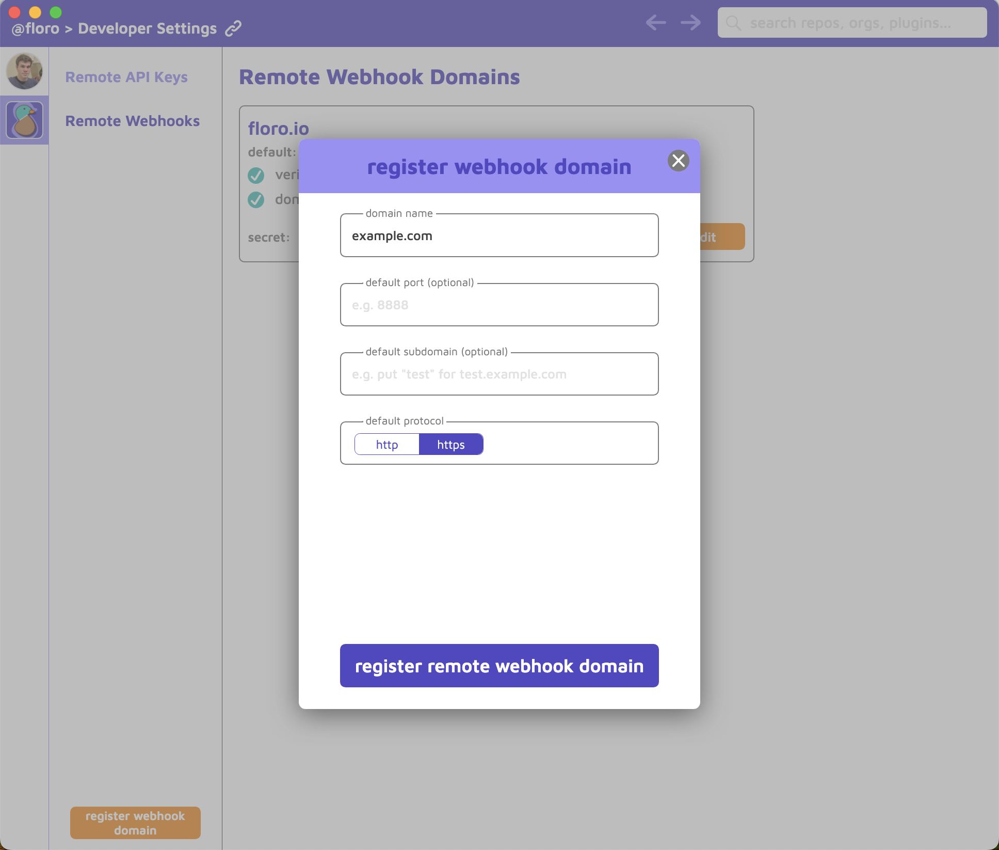

5) Verify your Remote Webhook Domain

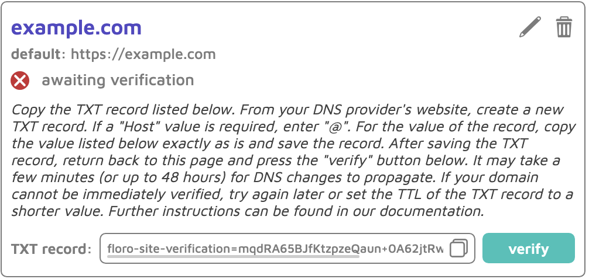

6) Create Local Webhook (optional, for local development)

(This is done from your personal dashboard, not an organization's dashboard)

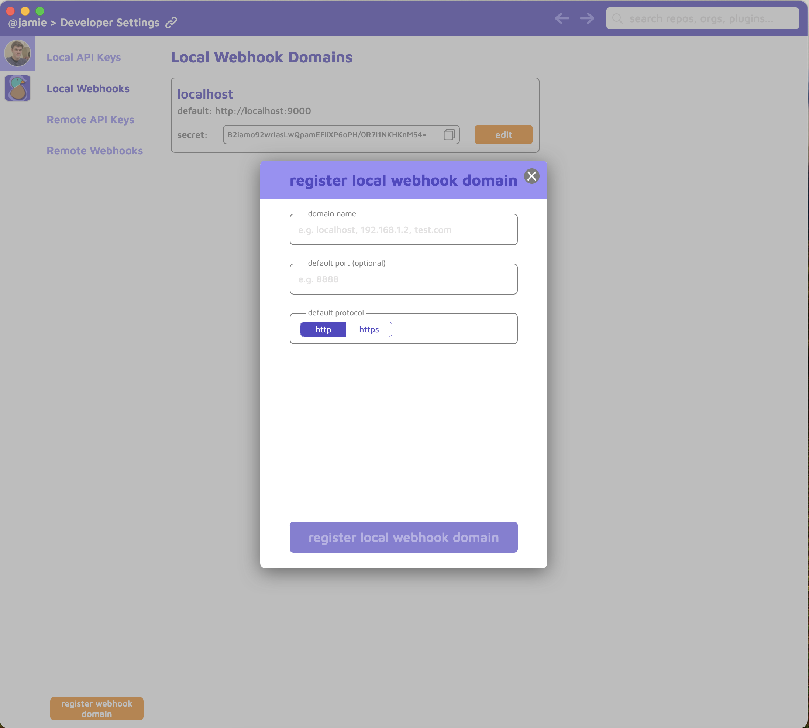

7) Navigate to your local repo

8) Click "local settings"


9) Enable the Local Keys and setup the webhook for Development


10) Navigate to your remote repo

11) Click "remote settings"


12) Click "Configure API Settings"


13) Enable the remote api keys (you may have separate keys for ci vs runtime) and add your production webhook call

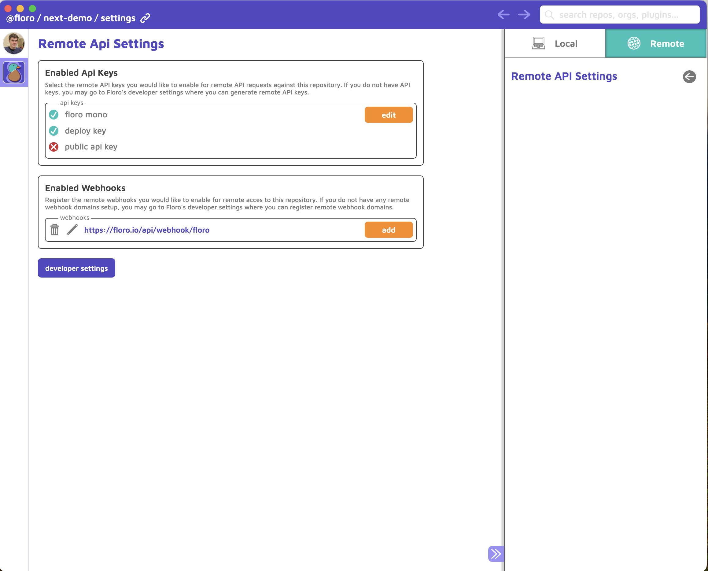


### Developing with Floro

For developers, we recommend avoiding branches and pushing to and pulling from main directly. I know, this sounds like advice that breaks everything you know about good version control hygiene but it's the simplest approach to dealing with submoduled system designs and makes the collaborative experience far simpler. This does mean you will be merging and resolving floro merge conflicts locally, not in merge requests. Remember, floro state is data, not code, it's easy to over analogize floro to git. Structured version control does not have the same risks as plain text version control.

Whatever the case may be you, if you are adding content to floro and developing features in tandem, you will need to your floro changes to end up in your main floro branch before you can merge your git changes into your git main branch.

#### (Re)Building your WIP

The command you will run all the time is `floro module current` from the `floro_infra` directory or `floro module current -m src/app/floro_infra/floro.module.js` from the root of your project.

This builds your current <i>work in progress</i> state without changing the `meta.floro.json` file. Just remember to commit and push to floro before pushing to git.

#### Avoid Hot Change Reloading

Floro has a command `floro module watch` that you can run from the `floro_infra` directory to allow your floro_modules to rebuild with each change you make to your local floro repository. This is a good feature for runtimes that don't support HMR but is very annoying if your app does support HMR. It is a way better experience to just use the floro debug socket. Use `floro module current` to update your floro_modules.


#### To gitignore floro_modules or to not gitignore floro_modules (CI considerations)

We recommend gitignoring floro_modules. However, if you are a solo developer, it may be easiest to just commit your floro_modules.

If you do gitignore your floro_modules you may have to do some CI work to add pulling floro module state to your CI workflow. Please see the <a href="https://floro.io/docs">floro docs</a>.

Here is how the floro website builds floro_modules in CI. See [Github Actions Example](https://github.com/florophore/floro-mono/blob/main/.github/workflows/create_build.yaml#L66).


### Your README.md


You should include the following setup step in your project documentation

```bash
npm install # or yarn
npm install -g floro
floro module sync -b -m src/app/floro_infra/floro.module.js
```